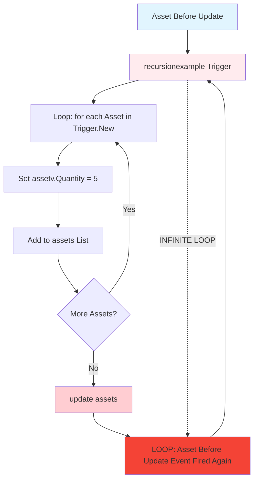
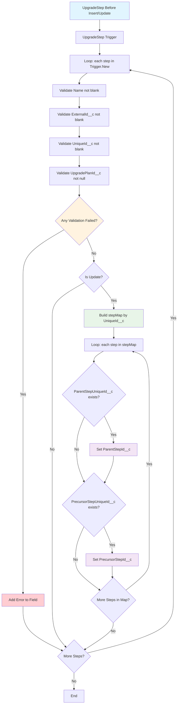
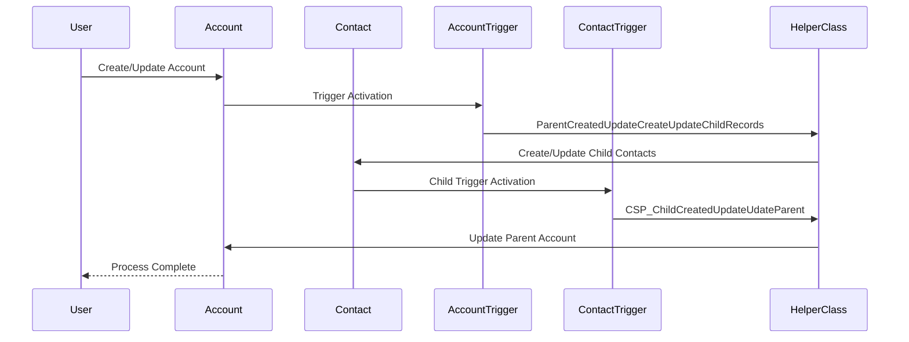
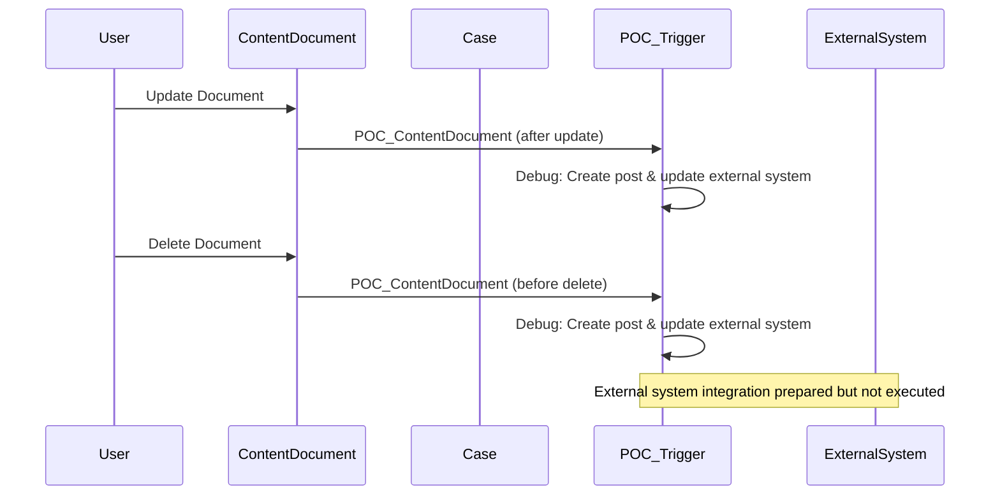
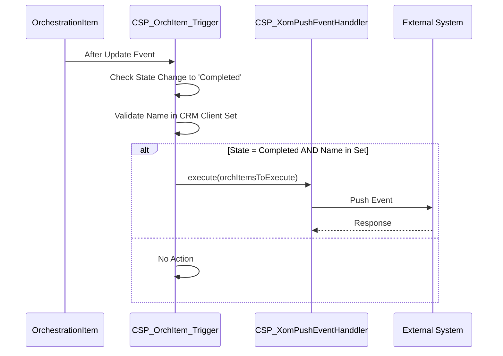
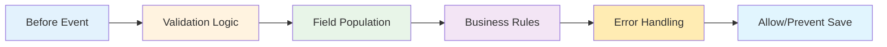
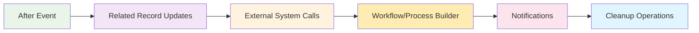
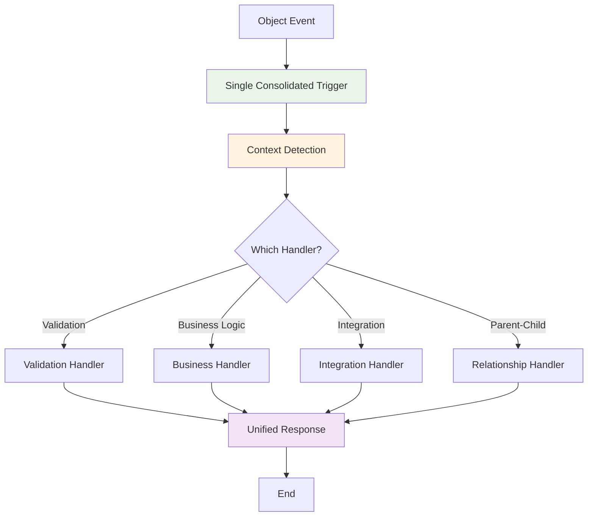

# Diagramas de Flujo de Triggers - Representación Visual

## Flujos Principales de Triggers

### 1. Patrón GSP_MetadataTriggerHandler (23 Triggers)

```mermaid
graph TD
    A[Object DML Event] --> B{Trigger Activated}
    B --> C[GSP_MetadataTriggerHandler().run()]
    C --> D[Load Metadata Configuration]
    D --> E{Handler Class Configured?}
    E -->|Yes| F[Execute Handler Class]
    E -->|No| G[Skip Processing]
    F --> H[Handler Logic Execution]
    H --> I[Field Validations]
    H --> J[Business Logic]
    H --> K[Related Record Processing]
    I --> L[End]
    J --> L
    K --> L
    G --> L

    style A fill:#e1f5fe
    style C fill:#f3e5f5
    style F fill:#e8f5e8
    style L fill:#fff3e0
```

### 2. Asset Trigger - Recursión Infinita (PROBLEMA CRÍTICO)



### 3. Account - Múltiples Triggers

```mermaid
graph TD
    A[Account DML Event] --> B{Which Trigger Executes?}
    B -->|Primary| C[CSP_AccountTrigger]
    B -->|Secondary| D[ParentCreatedUpdateCreateUpdateChildRecords]

    C --> E[GSP_MetadataTriggerHandler().run()]
    E --> F[Metadata-driven Processing]
    F --> G[Account Handler Logic]

    D --> H{Is After Insert/Update?}
    H -->|Yes| I[HelperForParentScenario.createUpdateChildRecord()]
    H -->|No| J[Pass Through]
    I --> K[Create/Update Child Records]

    G --> L[End]
    J --> L
    K --> L

    style A fill:#e1f5fe
    style C fill:#e8f5e8
    style D fill:#fff3e0
    style I fill:#f3e5f5
```

### 4. Contact - Cuatro Triggers Simultáneos

```mermaid
graph TD
    A[Contact DML Event] --> B[Multiple Triggers Execute]

    B --> C[CSP_ContactTrigger]
    B --> D[CSP_trigger_cl]
    B --> E[CSP_AccountContactRelTrigger]
    B --> F[CSP_ChildCreatedUpdateUdateParent]

    C --> G[GSP_MetadataTriggerHandler().run()]
    D --> H[GSP_MetadataTriggerHandler().run()]
    E --> I[Empty - No Logic]
    F --> J{Is After Insert/Update?}

    G --> K[Handler Logic 1]
    H --> L[Handler Logic 2]
    I --> M[Pass Through]
    J -->|Yes| N[CSP_ChildCreatedUpdateUdateParent.afterInsert()]
    J -->|No| O[Pass Through]

    N --> P[Update Parent Records]

    K --> Q[End]
    L --> Q
    M --> Q
    O --> Q
    P --> Q

    style A fill:#e1f5fe
    style B fill:#ffecb3
    style I fill:#f5f5f5
    style N fill:#e8f5e8
```

### 5. OrchestrationItem - Procesamiento Complejo

```mermaid
graph TD
    A[OrchestrationItem After Update] --> B[CSP_OrchItem_Trigger]
    B --> C{Is After Update?}
    C -->|No| D[End]
    C -->|Yes| E[Loop: oldOrchItem in Trigger.old]
    E --> F[Loop: newOrchItem in Trigger.new]
    F --> G{Same ID?}
    G -->|No| F
    G -->|Yes| H{State Changed to 'Completed'?}
    H -->|No| I{More Items?}
    H -->|Yes| J{Name in CRM Client Set?}
    J -->|No| I
    J -->|Yes| K[Add to orchItemsToExecute]
    K --> I
    I -->|Yes| F
    I -->|No| L{orchItemsToExecute not empty?}
    L -->|No| D
    L -->|Yes| M[CSP_XomPushEventHanddler.execute()]
    M --> N[External System Processing]
    N --> D

    style A fill:#e1f5fe
    style H fill:#fff3e0
    style J fill:#e8f5e8
    style M fill:#f3e5f5
    style N fill:#ffecb3
```

### 6. UpgradeStep - Validación y Relaciones



### 7. Triggers con Bypass Mechanism

```mermaid
graph TD
    A[Object DML Event] --> B{Which Object?}
    B -->|PortfolioManagement| C[CSP_PortfolioMngtTrigger]
    B -->|VodafoneBusinessTeam| D[CSP_VodafoneBusinessTeamTrigger]
    B -->|Other| E[Standard GSP Flow]

    C --> F{!CSP_PortfolioMngtHandler.bypassAccTrigger?}
    D --> G{!CSP_VodafoneBusinessTeamTriggerHandler.byPassVDFTrigger?}

    F -->|True| H[GSP_MetadataTriggerHandler().run()]
    F -->|False| I[Skip Processing]
    G -->|True| H
    G -->|False| I
    E --> H

    H --> J[Execute Handler Logic]
    I --> K[End]
    J --> K

    style A fill:#e1f5fe
    style F fill:#fff3e0
    style G fill:#fff3e0
    style I fill:#ffecb3
    style H fill:#e8f5e8
```

## Diagramas de Interacción entre Objetos

### 1. Account ↔ Contact Parent-Child Relationship



### 2. ContentDocument Processing Flow



### 3. OrchestrationItem → External System Integration



## Patrones de Ejecución por Contexto

### Before Triggers - Validation & Preparation



### After Triggers - Processing & Integration



## Recomendaciones de Flujo

### 1. Control de Recursión Recomendado

```mermaid
graph TD
    A[Trigger Entry] --> B{RecursionHelper.shouldRun()?}
    B -->|False| C[Exit - Already Running]
    B -->|True| D[Set Running Flag]
    D --> E[Execute Trigger Logic]
    E --> F[RecursionHelper.reset()]
    F --> G[End]
    C --> G

    style B fill:#fff3e0
    style C fill:#ffcdd2
    style D fill:#e8f5e8
    style F fill:#e8f5e8
```

### 2. Consolidación de Triggers Múltiples



---

Este documento proporciona representaciones visuales de los flujos de triggers más complejos e importantes del sistema, facilitando la comprensión de las interacciones y dependencies entre los diferentes componentes.
